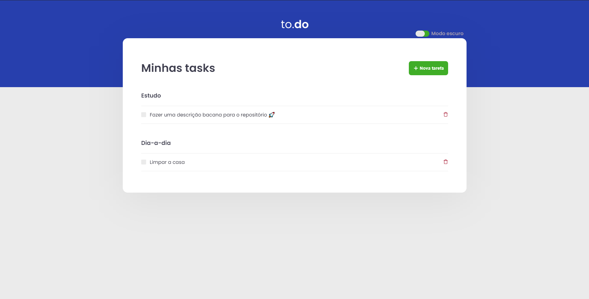
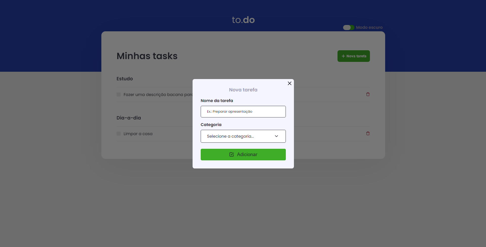
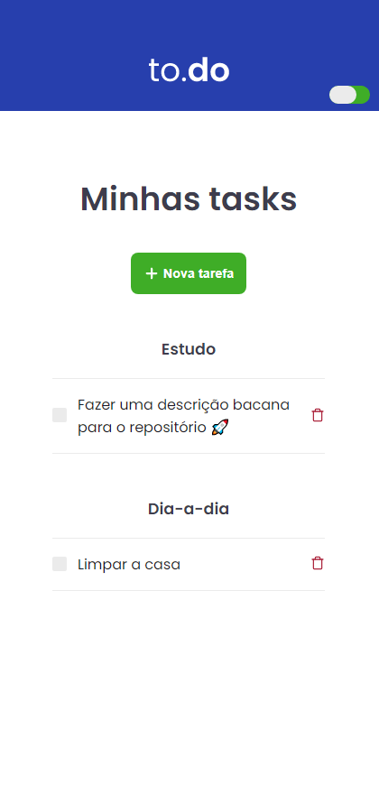
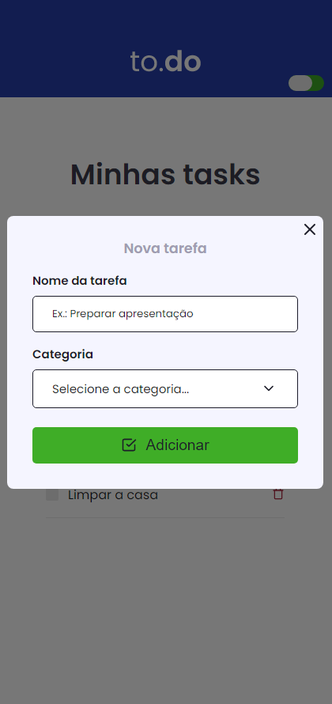
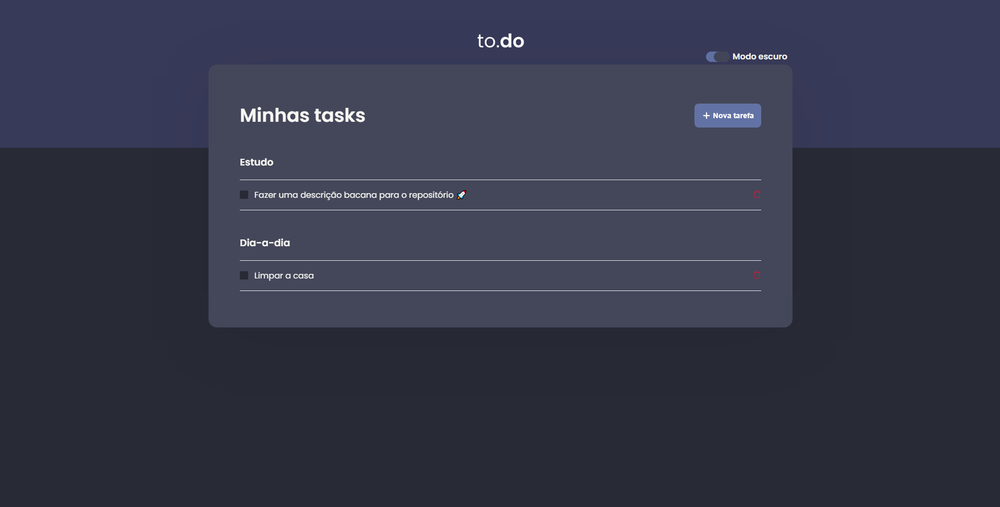
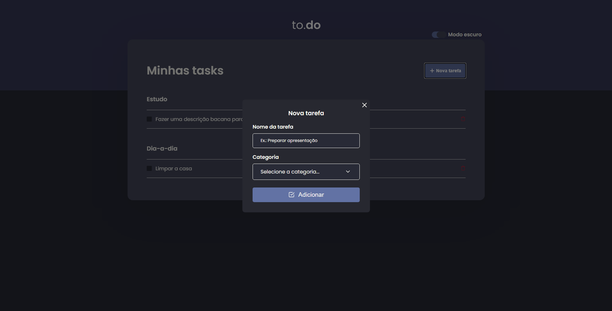
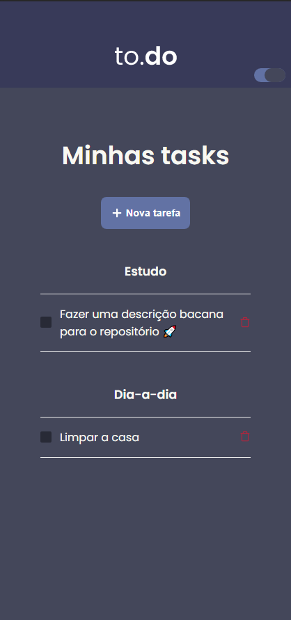
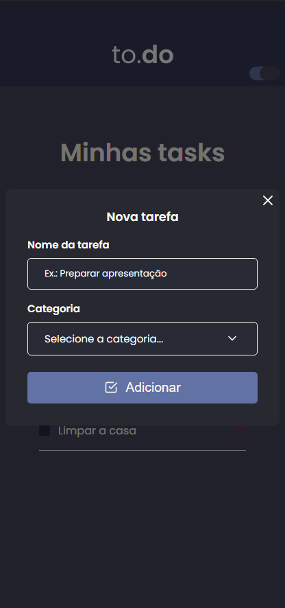

<p align="center">
  
</p>

<div align="center">
  
  
  
  
  
  
  
</div>

# 🚀 About project
<p>
  To.do is an application made to help you improve your daily tasks organization. You just inform your tasks and make as completed
  when finished doing your task.
</p>

<p>
  This application was made as an challenge during Rocketseat's Ignite course and improved by me after finished.
</p>

# 📎 Demo

<p>
  You can see a full demo of this app clicking <a href="http://todo.matheusferreira.dev">here</a>.
</p>

# 💻 App screens

## Light mode 🌞

<div>
  <div align="center">
    <h3>Desktop</h3>
    
    
  </div>

  <div align="center">
    <h3>Mobile</h3>
    
    
  </div>
</div>

## Dark mode 🌜

<div>
  <div align="center">
    <h3>Desktop</h3>
    
    
  </div>

  <div align="center">
    <h3>Mobile</h3>
    
    
  </div>
</div>

# 💿 Functionalities

- Add tasks
- Set categories to task
- Remove tasks
- List all tasks by categories
- Switch between dark and light modes
- Responsive web design techniques applied

# 🔎 Requirements

- Node.js
- Yarn/Npm

# ⚙ Installation

Follow this steps to install to.do in your local machine

```bash
  $ git clone https://github.com/ledoctah/to-do.git # clone the repository

  $ cd to-do # access the app directory

  $ yarn install # install all dependencies

  $ yarn dev # start the server in developer mode
```

After doing this steps, you should be able to access the application through http://localhost:8080/

## 📝 License

This project is under [MIT License](./LICENSE).

### Made with ❤ by [Matheus Ferreira](https://www.github.com/ledoctah)

[](https://www.linkedin.com/in/ferreira-matheus/)
